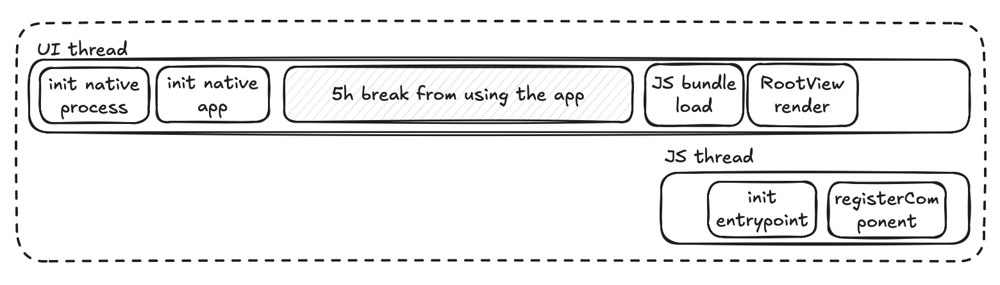

# Skill: Measure TTI (Time to Interactive)

> **MetaMask note — READ FIRST (verified):** `react-native-performance` v6 is **already installed**, and MetaMask already has a first-class instrumentation layer at **`app/util/trace.ts`**. **Do not tell engineers to install `react-native-performance` or hand-roll markers.** Use `trace()` / `endTrace()` with a `TraceName`.
>
> The startup pipeline is already traced. Startup `TraceName`s: `EngineInitialization`, `StoreInit`, `UIStartup`, `NavInit`, `VaultCreation`, `Login`, `AppStartBiometricAuthentication`. (Note: `StorageRehydration` is a `TraceOperation`, not a `TraceName` — use it as `op: TraceOperation.StorageRehydration`.)
>
> ```ts
> import { trace, endTrace, TraceName, TraceOperation } from '../../util/trace';
>
> // Callback form (auto-ends on resolve/reject)
> const data = trace(
>   { name: TraceName.Tokens, op: TraceOperation.UIStartup },
>   () => buildTokenList(),
> );
>
> // Manual form (span ends in a later render/effect — e.g. "screen interactive")
> trace({ name: TraceName.AssetDetails, op: TraceOperation.UIStartup });
> // ...when meaningful content is on screen...
> endTrace({ name: TraceName.AssetDetails });
> ```
>
> - To measure a **new** flow: add a `TraceName` (and `TraceOperation` if needed) to `app/util/trace.ts`, then wrap the flow.
> - ⚠️ **End the trace on _interactive / data-loaded_, not _mounted_.** An `endTrace` condition that is already `true` on the first render (e.g. `!isSearchVisible`, `!!component`, `isMounted`) closes the span at mount, before data loads — it silently measures ~zero and gives false confidence. End on the active view's data being ready (e.g. `conditions: [!isSearchVisible, hasActiveTabData]`). Real bug found in the Predict feed.
> - Numeric `tags` become Sentry **measurements** (queryable numerically). Spans **nest** via `parentContext`. Traces buffer until metrics consent, then flush.
> - **Real gaps (not the tool):** no automated **cold-start TTI gate in CI**, and no bundle-analysis script. The markers/targets below are still the right mental model for what "TTI" means.

Set up performance markers to measure app startup time and track TTI improvements.

> The rest of this file is the **upstream reference** for the TTI mental model. In MetaMask you do **not** install `react-native-performance` or call `performance.mark()` directly — it's already installed and wrapped by `app/util/trace.ts`. Read the pipeline/targets below for understanding, but instrument with `trace()`/`endTrace()` (see the MetaMask note above and [mm-tools.md](mm-tools.md)).

## Quick Command (MetaMask)

```tsx
// Already installed — instrument via trace(), not performance.mark()
import { trace, endTrace, TraceName, TraceOperation } from '../../util/trace';

trace({ name: TraceName.UIStartup, op: TraceOperation.UIStartup });
// ...when the screen is interactive...
endTrace({ name: TraceName.UIStartup });
```

## When to Use

- App startup feels slow
- Need baseline metrics for optimization
- Setting up performance monitoring
- Comparing TTI across releases

## Prerequisites

- `react-native-performance` is **already a devDependency** — do not install it. Instrument through `app/util/trace.ts`.

> **Note**: This skill involves visual timeline diagrams and profiler output. Use `agent-device` for cold-start evidence; install it through the environment's approved/trusted path or ask the user if verification needs it and it is missing. Timeline interpretation may still require exported metrics or human review.

## Understanding TTI

**Time to Interactive**: Time from app icon tap to displaying usable content.

### Startup Types

| Type | Description | Measure? |
|------|-------------|----------|
| Cold | App not in memory, full init | ✅ Yes |
| Warm | Process exists, activity recreated | ❌ Skip |
| Hot | App in background, resumed | ❌ Skip |
| Prewarmed (iOS) | iOS pre-initialized app | ❌ Filter out |

**Only measure cold starts** for consistent metrics.

## React Native Startup Pipeline



The diagram shows a warm start (app was in memory):

**UI Thread:**
1. `init native process` → `init native app`
2. Gap while user is away (e.g., "5h break from using the app")
3. `JS bundle load` → `RootView render`

**JS Thread (runs in parallel):**
- `init entrypoint` → `registerComponent`

**Pipeline markers:**
```
1. Native Process Init     (nativeLaunchStart → nativeLaunchEnd)
2. Native App Init         (appCreationStart → appCreationEnd)  
3. JS Bundle Load          (runJSBundleStart → runJSBundleEnd)
4. RN Root View Render     (contentAppeared)
5. React App Interactive   (screenInteractive) ← This is TTI
```

## Step-by-Step Implementation

### 1. Detect Cold Start

**iOS (Swift):**

```swift
let isColdStart = ProcessInfo.processInfo.environment["ActivePrewarm"] != "1"
```

**Android (Kotlin):**

```kotlin
class MainApplication : Application() {
    var isColdStart = false
    
    override fun onCreate() {
        super.onCreate()
        
        var firstPostEnqueued = true
        Handler().post { firstPostEnqueued = false }
        
        registerActivityLifecycleCallbacks(object : ActivityLifecycleCallbacks {
            override fun onActivityCreated(activity: Activity, savedInstanceState: Bundle?) {
                unregisterActivityLifecycleCallbacks(this)
                if (firstPostEnqueued && savedInstanceState == null) {
                    isColdStart = true
                }
            }
            // ... other callbacks
        })
    }
}
```

### 2. Check Foreground State

Only measure when app starts in foreground.

**iOS:**

```swift
var isForegroundProcess = false

override func application(_ application: UIApplication, 
    didFinishLaunchingWithOptions launchOptions: [UIApplication.LaunchOptionsKey: Any]?) -> Bool {
    if application.applicationState == .active {
        isForegroundProcess = true
    }
    return true
}
```

**Android:**

```kotlin
private fun isForegroundProcess(): Boolean {
    val processInfo = ActivityManager.RunningAppProcessInfo()
    ActivityManager.getMyMemoryState(processInfo)
    return processInfo.importance == IMPORTANCE_FOREGROUND
}
```

### 3. Set Up Performance Markers

Using `react-native-performance`:

**Native (iOS):**

```swift
import ReactNativePerformance

RNPerformance.sharedInstance().mark("appCreationStart")
// ... app init ...
RNPerformance.sharedInstance().mark("appCreationEnd")
```

**Native (Android):**

```kotlin
import com.oblador.performance.RNPerformance

RNPerformance.getInstance().mark("appCreationStart")
// ... app init ...
RNPerformance.getInstance().mark("appCreationEnd")
```

### 4. Mark Screen Interactive (JavaScript)

```tsx
import performance from 'react-native-performance';

export default function HomeScreen() {
    useEffect(() => {
        // Mark when meaningful content is displayed
        performance.mark('screenInteractive');
    }, []);
    
    return <TabNavigator />;
}
```

### 5. Collect and Report Metrics

```tsx
import performance from 'react-native-performance';

const collectTTIMetrics = () => {
    const entries = performance.getEntriesByType('mark');
    
    // Calculate durations
    const metrics = {
        nativeInit: getMarkDuration('nativeLaunchStart', 'nativeLaunchEnd'),
        appCreation: getMarkDuration('appCreationStart', 'appCreationEnd'),
        jsBundleLoad: getMarkDuration('runJSBundleStart', 'runJSBundleEnd'),
        tti: getMarkDuration('nativeLaunchStart', 'screenInteractive'),
    };
    
    // Send to analytics
    analytics.track('app_performance', metrics);
};
```

## Built-in Markers

`react-native-performance` provides automatic markers:

| Marker | Description |
|--------|-------------|
| `nativeLaunchStart` | Process start (pre-main) |
| `nativeLaunchEnd` | Native init complete |
| `runJSBundleStart` | JS bundle loading starts |
| `runJSBundleEnd` | JS bundle loaded |
| `contentAppeared` | RN root view rendered |

## Listening to Native Events

**iOS (JS Bundle Load):**

```swift
NotificationCenter.default.addObserver(
    self,
    selector: #selector(onJSLoad),
    name: NSNotification.Name("RCTJavaScriptDidLoadNotification"),
    object: nil
)
```

**Android (JS Bundle Load):**

```kotlin
ReactMarker.addListener { name ->
    when (name) {
        RUN_JS_BUNDLE_START -> { /* mark start */ }
        RUN_JS_BUNDLE_END -> { /* mark end */ }
        CONTENT_APPEARED -> { /* mark content */ }
    }
}
```

## Target Metrics

| Metric | Good | Acceptable | Needs Work |
|--------|------|------------|------------|
| TTI | < 2s | 2-4s | > 4s |
| JS Bundle Load | < 500ms | 500ms-1s | > 1s |
| Native Init | < 500ms | 500ms-1s | > 1s |

**Note**: Targets vary by app complexity and device tier.

## Common Pitfalls

- **Including prewarmed starts**: iOS prewarming skews metrics
- **Measuring warm/hot starts**: Only cold starts are meaningful
- **Wrong screenInteractive placement**: Mark when truly interactive, not just mounted
- **Not filtering background launches**: Push notifications can start app in background

## Related Skills

- [bundle-analyze-js.md](./bundle-analyze-js.md) - Reduce JS bundle load time
